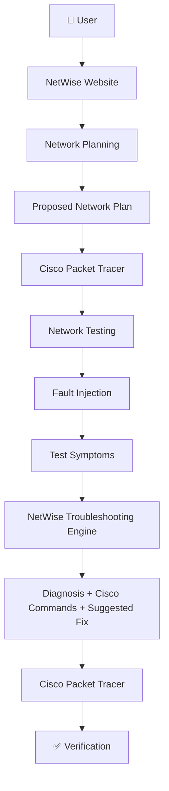
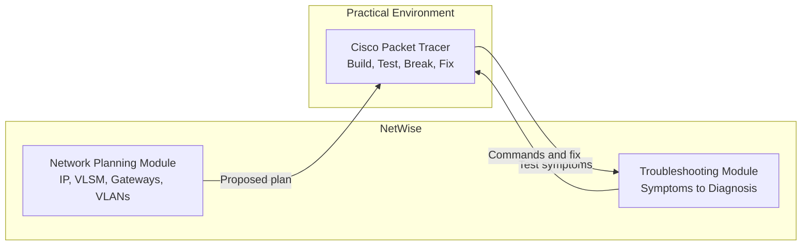
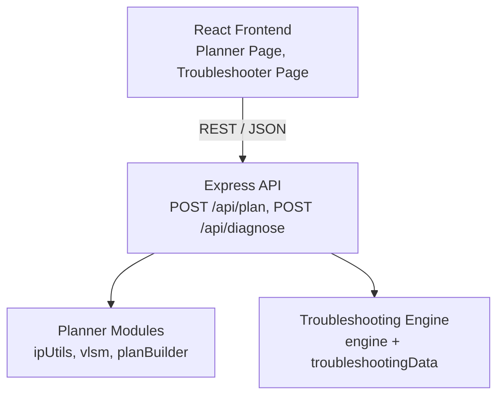

# 🌐 NetWise

**An Intelligent Network Planning and Troubleshooting System**

NetWise helps design small to medium enterprise networks from simple requirements and diagnoses common network faults from observed test symptoms, with Cisco Packet Tracer used as the hands-on environment for building and validating the design.

---

## 📖 Overview

NetWise is a web-based tool with two core modules:

- **Network Planning Module**: turns user requirements (departments, users, servers, internet access) into a proposed network plan with IP addressing, VLSM subnets, gateways, VLANs, and basic topology information.
- **Troubleshooting Module**: takes test results entered by the user (for example, which pings succeed and which fail) and identifies the likely fault, the Cisco commands to verify it, and a suggested fix.

The generated plan is implemented **manually** in Cisco Packet Tracer, where the network is tested, intentionally broken, diagnosed with NetWise, and fixed.

---

## ❗ Problem Statement

Designing and troubleshooting a network involves several error-prone steps:

- Calculating subnets and VLSM by hand is slow and easy to get wrong.
- Assigning gateways, VLANs, and address ranges consistently across departments requires careful planning.
- When a network fails, symptoms such as "ping fails" can point to many different causes (addressing, gateway, VLAN, routing, DHCP, DNS, or NAT).
- Students and beginners often do not know which Cisco commands to run to isolate a fault.

---

## 💡 Solution

NetWise addresses these problems by:

1. Generating a structured addressing and VLAN plan from high-level requirements.
2. Mapping observed test symptoms to the most likely network fault.
3. Recommending specific Cisco IOS commands and checks to confirm the fault.
4. Suggesting a fix that can be applied and verified in Cisco Packet Tracer.

---

## ⚙️ How NetWise Works

| Step | Action | Where |
|------|--------|-------|
| 1 | Enter network requirements | NetWise website |
| 2 | Generate the proposed network plan | NetWise (Planning Module) |
| 3 | Build and configure the network | Cisco Packet Tracer (manual) |
| 4 | Test connectivity | Cisco Packet Tracer |
| 5 | Intentionally introduce a fault | Cisco Packet Tracer |
| 6 | Enter the observed test symptoms | NetWise website |
| 7 | Diagnose the likely problem | NetWise (Troubleshooting Module) |
| 8 | Review Cisco commands, checks, and suggested fix | NetWise website |
| 9 | Apply the fix | Cisco Packet Tracer (manual) |
| 10 | Test again to verify | Cisco Packet Tracer |

---

## 🏗️ System Architecture

### End-to-End Flow



### Component Roles



### Application Layers



The Express routes only validate input and call the planner or troubleshooting modules. All networking logic lives in plain JavaScript modules that are independent of the web framework and covered by unit tests.

> **Note:** NetWise does not control or connect to Cisco Packet Tracer. All configuration, testing, and fault injection in Packet Tracer are performed manually by the user.

---

## ✨ Main Features

### Network Planning

| Input | Output |
|-------|--------|
| Number of departments | Subnets using VLSM |
| Number of users/devices per department | IP address ranges and subnet masks |
| Servers required | Default gateways |
| Internet access required (yes/no) | VLAN IDs and names |
| | Basic topology information |

### Troubleshooting

Supported fault categories:

- Wrong IP address
- Wrong default gateway
- VLAN mismatch
- Missing route
- DHCP failure
- DNS failure
- NAT/PAT problems

---

## 🖧 Cisco Packet Tracer Integration

Cisco Packet Tracer is the practical environment where the NetWise design is validated. It is used to:

- **Build** the topology proposed by NetWise (routers, switches, PCs, servers).
- **Configure** interfaces, VLANs, routing, DHCP, DNS, and NAT/PAT based on the generated plan.
- **Test** connectivity using `ping`, `tracert`, and IOS `show` commands.
- **Break** the network by introducing a known fault.
- **Fix** the fault using the commands and solution suggested by NetWise.
- **Verify** that connectivity is restored.

Test scenarios and their results are documented in [`packet-tracer/test-cases.md`](packet-tracer/test-cases.md).

---

## 🛠️ Troubleshooting Workflow

The Troubleshooting Module is rule-based. Symptoms are entered through structured options (for example, gateway ping: success/fail) and compared against predefined fault patterns. Since different faults can produce similar symptoms, NetWise returns a **ranked list** of likely faults based on how many conditions of each rule match.

| Fault | Typical Symptom | Recommended Checks | Suggested Fix |
|-------|-----------------|--------------------|---------------|
| Wrong IP address | Cannot ping default gateway | `ipconfig` (PC), `show ip interface brief` | Assign an IP in the correct subnet |
| Wrong default gateway | Local pings succeed, remote pings fail | `ipconfig` (PC) | Set the gateway to the router interface IP |
| VLAN mismatch | Hosts in the same VLAN cannot communicate | `show vlan brief`, `show interfaces trunk` | Assign ports to the correct VLAN, fix trunk settings |
| Missing route | Gateway ping succeeds, remote network ping fails | `show ip route` | Add a static route or fix the routing protocol config |
| DHCP failure | PC receives a `169.254.x.x` address | `show ip dhcp pool`, `show ip dhcp binding`, `show running-config` | Fix the DHCP pool or add `ip helper-address` |
| DNS failure | Ping by IP succeeds, ping by name fails | `ipconfig /all` (PC), `nslookup` | Set the correct DNS server address |
| NAT/PAT problem | Internal traffic works, internet access fails | `show ip nat translations`, `show ip nat statistics`, `show access-lists` | Fix `ip nat inside/outside` and the NAT ACL |

---

## 📁 Project Structure

Planned structure:

```
NetWise/
├── README.md
├── backend/
│   ├── package.json
│   ├── src/
│   │   ├── server.js                  # Express app, serves API and built frontend
│   │   ├── validation.js              # IPv4, prefix, and host count checks
│   │   ├── routes/
│   │   │   ├── plan.routes.js         # POST /api/plan
│   │   │   └── diagnose.routes.js     # POST /api/diagnose, GET /api/faults
│   │   ├── planner/
│   │   │   ├── ipUtils.js             # IP/integer conversion, masks, block sizes
│   │   │   ├── vlsm.js                # VLSM subnet allocation
│   │   │   └── planBuilder.js         # VLANs, gateways, WAN link, topology
│   │   └── troubleshooting/
│   │       ├── troubleshootingData.js # Fault rules, Cisco checks, and fixes
│   │       └── engine.js              # Rule matching and ranking
│   └── tests/
│       ├── ipUtils.test.js
│       ├── vlsm.test.js
│       └── engine.test.js
├── frontend/
│   ├── package.json
│   ├── vite.config.js                 # Proxies /api to the backend in development
│   ├── index.html
│   └── src/
│       ├── main.jsx
│       ├── App.jsx
│       ├── api.js                     # fetch calls to the backend
│       ├── pages/                     # HomePage, PlannerPage, TroubleshootPage
│       └── components/                # Forms, plan table, topology view, diagnosis card
└── packet-tracer/
    ├── test-cases.md                  # Packet Tracer test and fault scenarios
    └── netwise-demo.pkt               # Packet Tracer implementation of a generated plan
```

### API Endpoints

| Method | Endpoint | Purpose |
|--------|----------|---------|
| `POST` | `/api/plan` | Generate a network plan from requirements |
| `POST` | `/api/diagnose` | Return ranked likely faults for the given symptoms |
| `GET` | `/api/faults` | List supported fault categories |

---

## 🧪 Example

### Planning Example

**Input:** Base network `192.168.10.0/24`, internet access required.

| Department | Hosts Needed | VLAN | Network | Subnet Mask | Default Gateway |
|------------|:------------:|:----:|---------|-------------|-----------------|
| Admin | 50 | 10 | 192.168.10.0/26 | 255.255.255.192 | 192.168.10.1 |
| Sales | 25 | 20 | 192.168.10.64/27 | 255.255.255.224 | 192.168.10.65 |
| IT | 10 | 30 | 192.168.10.96/28 | 255.255.255.240 | 192.168.10.97 |
| Servers | 5 | 40 | 192.168.10.112/29 | 255.255.255.248 | 192.168.10.113 |

### Troubleshooting Example

**Symptoms entered:**

```
Gateway ping:         SUCCESS
Remote network ping:  FAILED
```

**NetWise output:**

```
Possible problem:
  Routing issue

Recommended check:
  show ip route

Suggested solution:
  Check whether a route exists to the remote network.
```

---

## 🧰 Technologies Used

| Category | Technology | Purpose |
|----------|------------|---------|
| Language | JavaScript | Used across frontend and backend |
| Frontend | React, Vite, React Router | User interface and page navigation |
| Styling | Tailwind CSS | Clean, consistent UI |
| Backend | Node.js, Express | REST API for planning and diagnosis |
| Network Logic | Custom JavaScript modules | VLSM, subnetting, and rule-based troubleshooting |
| Testing | Vitest | Verifies subnet calculations and diagnosis rules |
| Network Simulation | Cisco Packet Tracer | Manual implementation, testing, and fault injection |
| Deployment | Render | Single service hosting the API and frontend |
| Version Control | Git, GitHub | Source control |

No database is used. Network plans are calculated on demand and troubleshooting rules are stored as data in the codebase.

---

## 🚀 Future Scope

- Plan-aware diagnosis that compares entered device settings against the generated plan.
- Support for additional faults such as ACL misconfiguration and STP issues.
- Generation of ready-to-paste Cisco IOS configuration snippets from the network plan.
- Export of the network plan as a downloadable report.
- Saved plans and diagnosis history using SQLite, if persistence becomes necessary.
- Support for larger networks with multiple routers and dynamic routing protocols.

---

